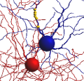

### Note from the ModelDB Administrator:  The following is an excerpt taken on August 18th 2010 from the  
[Neuroconstruct projects page](http://www.neuroconstruct.org/models/index.html#VervaekeEtAl-GolgiCellNetwork-N10305)  
which contains a link to the Vervaeke et al. 2010 Golgi cell network model.

### VervaekeEtAl-GolgiCellNetwork

|  |  |  |
|---|---|---|
|  <!-- Click to enlarge --> | **Project name:** **VervaekeEtAl-GolgiCellNetwork**  
Network of electrically coupled cerebellar Golgi cells, as described in Vervaeke et al. Rapid Desynchronization of an Electrically Coupled Interneuron Network with Sparse Excitatory Synaptic Input, *Neuron* 2010.  
  
Project last modified: Thursday August 12, 2010 | Downloads[*](#downloadInfo):  
  
[neuroConstruct project](http://www.neuroconstruct.org/models/downloads/VervaekeEtAl-GolgiCellNetwork.ncx.zip)  
Download full project for loading into neuroConstruct  
  
  
  
Download core project elements in NeuroML format |

[*](#downloadInfo) Note: neuroConstruct project downloads (most of which are included with the standard software distribution) can be loaded directly into neuroConstruct to generate cell and network scripts for NEURON, GENESIS, etc., but NeuroML downloads just consist of the core elements of the project (morphologies, channels, etc.) which have been exported in NeuroML format. The latter can be useful for testing NeuroML compliant applications. If no NeuroML download link is present, this usually indicates that the model is mainly implemented using channel/synapse mechanisms in a simulator's native language (e.g. mod files) which have not fully been converted to ChannelML yet.

---

Copyright © 2010 UCL  
All rights reserved.  
- Last Published: 08/12/2010 13:37:56

---

2025-06-02: Converted README to Markdown.